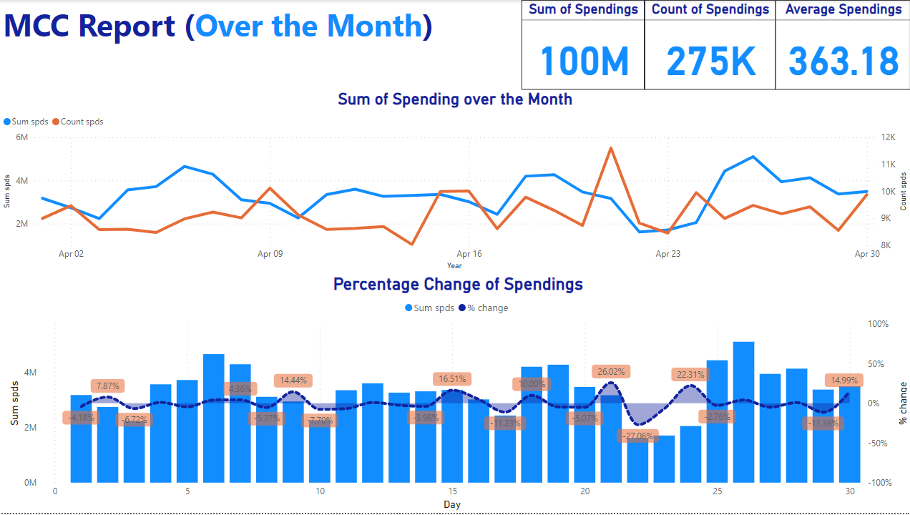
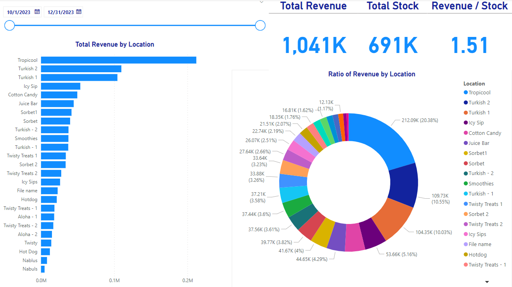

# Data Scientist & Analyst

### Technichal Skills: Python, Excel, Queries, Power bi

## Education
- Advanced Levels in Mathematics, Economics & Psycholgoy | CAIE 
- Bsc in Statistical Data Science | Heriot Watt University

## Work Experience
**Data Analyst @ Sidra Salman & CO. Chartered Accountants (December 2023 - Present)**
- Worked with raw data in the industry. Data such as multiple restaurant accounts, wages of companies and bank transfers.
- Applied statistical analysis using different tools.
- Created multiple insights & reports as per clients' likings.

## Projects
### Reports of Employees in Client's Firms
- Worked with company's data which included income, attendance, designation, overtime & other various data.
- Created reports on each category to call out important insights that may concern a company & the managers.

### Managing Restaurants' Database
- Worked with multiple restaurants' data in different locations which included menu item stocks & prices.
- Published monhtly reports of each restaurant regarding trends in each food category, forecasted revenue & profit.

### Bank Reports
- Was granted access to hundreds of thousands of bank transfers with different banks' credit & debit cards.
- Published reports on the different cards & banks highlighting trends.

## Example Work
- Every excel sheet is fully automated, which requires no additional manual handling.
- Power bi reports are fully interactional & relevant according to client's needs.

